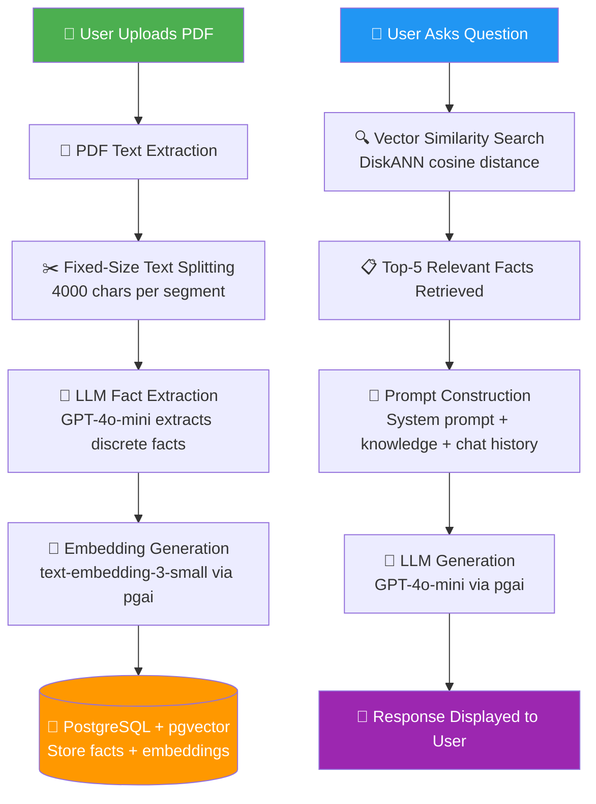
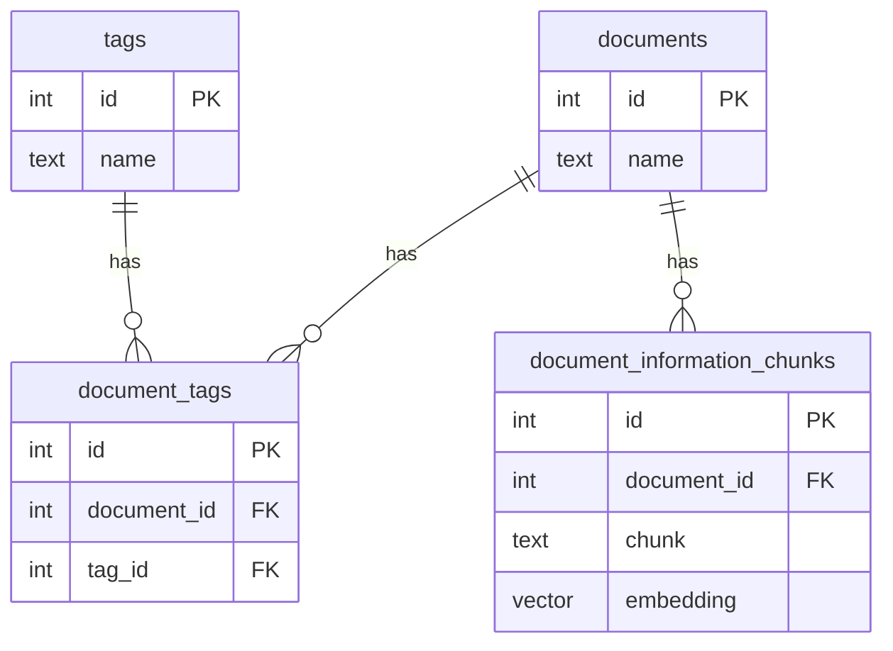

# 📄 Chat With Docs — RAG-Powered Document Q&A System

> **Owner:** Sankar Chaitanya  
> **License:** MIT  
> **Status:** Learning Prototype

---

## 📌 Project Overview

### What Problem Does This Solve?

Organizations and individuals accumulate vast amounts of knowledge in PDF documents — research papers, manuals, reports, policies. Finding specific information across dozens or hundreds of documents is time-consuming and error-prone. Traditional keyword search fails when users don't know the exact terminology used in the documents.

**Chat With Docs** solves this by allowing users to have a natural-language conversation with their document collection. Instead of searching for keywords, you simply ask a question in plain English, and the system retrieves relevant information and generates a contextual answer.

### Why Is RAG Needed?

Large Language Models (LLMs) like GPT-4 are powerful but have two critical limitations:

1. **Knowledge cutoff**: They only know what was in their training data. They don't know about your private documents.
2. **Hallucination**: When asked about topics they don't know, they often generate plausible-sounding but incorrect answers.

**Retrieval-Augmented Generation (RAG)** solves both problems by:
1. **Retrieving** relevant information from your documents first
2. **Augmenting** the LLM's prompt with that retrieved context
3. **Generating** an answer grounded in your actual documents

This means the LLM only answers based on your documents, dramatically reducing hallucination and enabling it to work with private, up-to-date information.

### What Type of RAG Pipeline Does This Implement?

This project implements a **Naive/Vanilla RAG** pipeline with a unique twist: all LLM operations (embedding generation AND chat completion) are executed **inside PostgreSQL** via the `pgai` extension, rather than through the standard OpenAI Python SDK.

The pipeline also uses **LLM-based fact extraction** instead of naive text splitting, which produces higher-quality retrieval chunks.

---

## 🏗️ High-Level Architecture

### System Flow



### Stage-by-Stage Explanation

| Stage | What Happens | Why It Matters |
|-------|-------------|----------------|
| **1. PDF Upload** | User uploads a PDF through the Streamlit UI | Entry point for knowledge ingestion |
| **2. Text Extraction** | `pdftotext` library extracts raw text from PDF pages | Converts binary PDF to processable text |
| **3. Text Splitting** | Raw text is split into 4000-character segments | LLMs have input limits; we need manageable pieces |
| **4. Fact Extraction** | GPT-4o-mini analyzes each segment and extracts discrete facts | Creates high-quality, self-contained retrieval units |
| **5. Embedding** | Each fact is converted to a 1536-dimensional vector via `text-embedding-3-small` | Vectors enable mathematical similarity comparison |
| **6. Storage** | Facts + embeddings stored in PostgreSQL with pgvector | Persistent, indexed storage for fast retrieval |
| **7. User Query** | User types a question in the chat interface | Triggers the retrieval pipeline |
| **8. Vector Search** | Query is embedded and compared against all stored fact vectors using cosine distance | Finds the most semantically similar facts |
| **9. Context Assembly** | Top 5 most relevant facts are assembled into a knowledge block | Provides the LLM with grounded information |
| **10. Generation** | GPT-4o-mini generates an answer using the knowledge + conversation history | Produces a contextual, grounded response |

---

## 📁 Folder Structure

```
chat-with-docs/
├── main.py                          # Application entry point
├── constants.py                     # LLM system prompt templates
├── db.py                            # Database models and configuration
├── env.py                           # Environment variable loader
├── utils.py                         # Generic utility functions
├── requirements.txt                 # Python dependencies
└── pages/                           # Streamlit multi-page app
    ├── Chat With Documents.py       # Chat interface & RAG pipeline
    ├── Manage Documents.py          # Document upload & management
    └── Manage Tags.py               # Tag CRUD operations
```

### File Explanations

| File | Purpose | Why It Exists |
|------|---------|---------------|
| `main.py` | Streamlit entry point. Loads env vars and displays the app title. Run with `streamlit run main.py` | Every Streamlit multi-page app needs a root script |
| `constants.py` | Stores the three system prompts used for LLM interactions: fact extraction, tag matching, and chat response | Centralizes prompt engineering so prompts can be modified without touching logic |
| `db.py` | Defines all database models (Documents, Tags, DocumentTags, DocumentInformationChunks) using Peewee ORM, and configures the PostgreSQL connection with pgvector | Separates data layer from application logic |
| `env.py` | Loads `.env` file variables into the environment using `python-dotenv` | Keeps secrets out of source code |
| `utils.py` | Contains a generic `find()` helper function for searching iterables | Provides reusable utility functions |
| `requirements.txt` | Lists all Python package dependencies with pinned versions | Ensures reproducible installations |
| `pages/Chat With Documents.py` | The core RAG chat interface. Handles user queries, vector search, context assembly, and LLM response generation | This is where the RAG retrieval + generation pipeline lives |
| `pages/Manage Documents.py` | Handles PDF upload, text extraction, fact generation, embedding creation, and document deletion. Also manages auto-tagging | This is where the RAG ingestion pipeline lives |
| `pages/Manage Tags.py` | Simple CRUD interface for creating and deleting tags that can be associated with documents | Provides organizational metadata for documents |

---

## 🔄 End-to-End Execution Flow

### Flow 1: Document Ingestion (Upload)

When a user uploads a PDF document, here is exactly what happens:

**Step 1 — File Upload**
The user clicks "Upload Document" on the Manage Documents page. A dialog appears with a file uploader restricted to PDF files. The user selects a PDF and clicks "Upload".

**Step 2 — PDF Text Extraction**
```python
parsed_pdf = pdftotext.PDF(BytesIO(pdf_file))
pdf_text = "\n\n".join(parsed_pdf)
```
The `pdftotext` library reads the raw PDF bytes and extracts text from every page. Pages are joined with double newlines.

**Step 3 — Fixed-Size Splitting**
```python
for i in range(0, len(pdf_text), IDEAL_CHUNK_LENGTH):
    pdf_text_chunks.append(pdf_text[i:i + IDEAL_CHUNK_LENGTH])
```
The full text is split into 4000-character segments. This is a naive split — it can cut words mid-sentence.

**Step 4 — LLM Fact Extraction (Parallel)**
Each text segment is sent to GPT-4o-mini with a system prompt asking it to extract discrete facts. All segments are processed in parallel using `asyncio.gather()`. The LLM returns JSON: `{"facts": ["fact 1", "fact 2", ...]}`.

**Step 5 — Tag Matching (Parallel)**
Simultaneously, the first 5000 characters of the document are sent to GPT-4o-mini with a list of existing tags. The LLM identifies which tags are relevant to this document.

**Step 6 — Database Insertion (Atomic Transaction)**
In a single database transaction:
1. A new `Documents` row is created
2. Each extracted fact is inserted into `DocumentInformationChunks` with its embedding (generated on-the-fly by pgai)
3. Matched tag associations are inserted into `DocumentTags`

If any step fails, the entire transaction rolls back.

### Flow 2: Chat / Question Answering

When a user asks a question, here is exactly what happens:

**Step 1 — Query Input**
The user types a question into the Streamlit chat input.

**Step 2 — Vector Search**
```sql
SELECT * FROM documentinformationchunks 
ORDER BY embedding <-> ai.openai_embed('text-embedding-3-small', 'user question')
LIMIT 5
```
The user's question is embedded in real-time and compared against all stored fact embeddings using cosine distance. The 5 most similar facts are returned.

**Step 3 — Context Assembly**
The retrieved facts are numbered and injected into the system prompt:
```
Knowledge you have:
1. First relevant fact
2. Second relevant fact
...
```

**Step 4 — LLM Generation**
The complete conversation history (all previous messages) plus the knowledge-augmented system prompt are sent to GPT-4o-mini. The LLM generates a response grounded in the retrieved facts.

**Step 5 — Display**
The response is displayed in the chat interface. User messages show expandable "References" sections listing the retrieved facts that informed the answer.

---

## 🔧 Beginner-Friendly Function & Class Documentation

### File: `env.py`

#### `load_dotenv(verbose=True, override=True)`
- **Purpose:** Loads environment variables from a `.env` file into the system environment
- **Inputs:** `verbose=True` (print status), `override=True` (overwrite existing env vars)
- **Outputs:** None (side effect: populates `os.environ`)
- **Why it exists:** Secrets like database passwords and API keys should never be hardcoded. This loads them from a `.env` file that is excluded from version control
- **Interactions:** Called by `main.py` via `from env import *`; must run before any database or API access

---

### File: `constants.py`

#### `CREATE_FACT_CHUNKS_SYSTEM_PROMPT` (string constant)
- **Purpose:** System prompt that instructs GPT-4o-mini to extract facts from text
- **Value:** Tells the LLM to analyze text and output `{"facts": ["fact 1", "fact 2", ...]}`
- **Used by:** `Manage Documents.py → generate_chunks()`

#### `GET_MATCHING_TAGS_SYSTEM_PROMPT` (string constant)
- **Purpose:** System prompt for auto-tagging. Contains a `{{tags_to_match_with}}` placeholder
- **Value:** Instructs the LLM to identify matching tags from a provided list
- **Used by:** `Manage Documents.py → get_matching_tags()`

#### `RESPOND_TO_MESSAGE_SYSTEM_PROMPT` (string constant)
- **Purpose:** System prompt for the chat interface. Contains a `{{knowledge}}` placeholder
- **Value:** Instructs the LLM to only answer using provided knowledge, never make up information
- **Used by:** `Chat With Documents.py → send_message()`

---

### File: `utils.py`

#### `find(predicate, iterable) → item | None`
- **Purpose:** Finds the first element in an iterable that matches a condition
- **Inputs:** `predicate` — a function that takes an element and returns True/False; `iterable` — any iterable (list, query result, etc.)
- **Outputs:** The first matching element, or `None` if nothing matches
- **Internal logic:** Iterates through each element, applies the predicate, returns immediately on first match
- **Why it exists:** Python's stdlib doesn't have a built-in `find()` for iterables (only `filter()` which returns all matches)
- **Used by:** `Manage Documents.py → get_matching_tags()` to find a tag object by its name
- **Example:**
  ```python
  find(lambda x: x > 3, [1, 2, 3, 4, 5])  # Returns 4
  find(lambda x: x > 10, [1, 2, 3])         # Returns None
  ```

---

### File: `db.py`

#### `db` (PostgresqlDatabase instance)
- **Purpose:** The global database connection object
- **Configuration:** Reads host, port, name, user, password from environment variables
- **Interactions:** Used by every model class and every database operation in the application

#### `class Documents(Model)`
- **Purpose:** ORM model representing an uploaded PDF document
- **Fields:** `id` (auto), `name` (TextField — the PDF filename)
- **Table:** `documents`
- **Relationships:** Has many `DocumentTags`, has many `DocumentInformationChunks`

#### `class Tags(Model)`
- **Purpose:** ORM model representing a categorization tag
- **Fields:** `id` (auto), `name` (TextField — the tag label)
- **Table:** `tags`
- **Relationships:** Has many `DocumentTags`

#### `class DocumentTags(Model)`
- **Purpose:** Junction/bridge table linking documents to tags (many-to-many)
- **Fields:** `document_id` (FK → Documents), `tag_id` (FK → Tags)
- **Table:** `document_tags`
- **Cascade:** Deleting a document or tag automatically removes the association

#### `class DocumentInformationChunks(Model)`
- **Purpose:** Stores individual facts extracted from documents along with their vector embeddings
- **Fields:** `document_id` (FK → Documents), `chunk` (TextField — the fact text), `embedding` (VectorField, 1536 dimensions)
- **Table:** `document_information_chunks`
- **Index:** DiskANN index on `embedding` for fast approximate nearest neighbor search

#### `set_diskann_query_rescore(query_rescore: int)`
- **Purpose:** Configures DiskANN's rescore parameter for the current database session
- **Inputs:** `query_rescore` — number of candidates to re-evaluate after initial ANN search (higher = more accurate, slower)
- **Why it exists:** DiskANN is an approximate search; rescoring improves accuracy by re-evaluating more candidates with exact distance computation
- **Used by:** `Chat With Documents.py → send_message()` with value 100

#### `set_openai_api_key()`
- **Purpose:** Sets the OpenAI API key as a PostgreSQL session variable so the `pgai` extension can make API calls
- **Why it exists:** The pgai extension runs inside PostgreSQL and needs the API key to call OpenAI endpoints
- **Security note:** ⚠️ This exposes the API key in the database session

---

### File: `pages/Chat With Documents.py`

#### `class Message(TypedDict)`
- **Purpose:** Type definition for chat messages
- **Fields:** `role` ("user" | "assistant"), `content` (str), `references` (optional list of retrieved fact strings)

#### `push_message(message: Message)`
- **Purpose:** Appends a new message to the session state conversation history
- **Inputs:** A `Message` dict
- **Internal logic:** Creates a new list by spreading existing messages + new message (immutable update pattern)
- **Why it exists:** Streamlit's session state requires explicit updates to trigger re-renders

#### `async send_message(input_message: str)`
- **Purpose:** The core RAG pipeline — retrieves relevant facts, generates an LLM response, and updates the conversation
- **Inputs:** The user's question as a string
- **Internal logic:**
  1. Opens a database transaction
  2. Sets DiskANN rescore to 100 for higher accuracy
  3. Embeds the user query and performs cosine similarity search for top-5 facts
  4. Pushes the user message (with retrieved facts as references)
  5. Constructs the full conversation history as SQL JSON
  6. Sends to GPT-4o-mini with the knowledge-augmented system prompt
  7. Pushes the assistant response message
  8. Retries up to 5 times on failure with 1-second delays
- **Outputs:** None (side effect: updates session state and triggers rerun)

---

### File: `pages/Manage Documents.py`

#### `delete_document(document_id: int)`
- **Purpose:** Deletes a document and all associated data (chunks, tags) via cascade
- **Inputs:** The document's database ID
- **Internal logic:** Simple `DELETE WHERE id = document_id`

#### `class GeneratedDocumentInformationChunks(BaseModel)`
- **Purpose:** Pydantic model for validating the LLM's JSON response when extracting facts
- **Fields:** `facts: list[str]`

#### `async generate_chunks(index: int, pdf_text_chunk: str) → list[str]`
- **Purpose:** Sends a text segment to GPT-4o-mini and gets back a list of extracted facts
- **Inputs:** `index` — segment number (for logging), `pdf_text_chunk` — the text to analyze
- **Outputs:** A list of fact strings
- **Internal logic:** Calls GPT-4o-mini via pgai SQL, validates JSON response with Pydantic, retries up to 5 times
- **Interactions:** Called in parallel by `upload_document()` for each text segment

#### `class GeneratedMatchingTags(BaseModel)`
- **Purpose:** Pydantic model for validating the LLM's tag matching response
- **Fields:** `tags: list[str]`

#### `async get_matching_tags(pdf_text: str) → list[int]`
- **Purpose:** Uses GPT-4o-mini to identify which existing tags are relevant to a document
- **Inputs:** First 5000 characters of the document text
- **Outputs:** List of matching tag IDs
- **Internal logic:** Fetches all existing tags, sends them + document text to LLM, validates response, looks up tag IDs

#### `upload_document(name: str, pdf_file: bytes)`
- **Purpose:** The complete document ingestion pipeline — extract text, generate facts, create embeddings, match tags, store everything
- **Inputs:** PDF filename and raw bytes
- **Internal logic:**
  1. Extract text from PDF using `pdftotext`
  2. Split into 4000-char segments
  3. Run fact extraction + tag matching in parallel via `asyncio.gather()`
  4. Flatten all facts from all segments
  5. Insert document, chunks with embeddings, and tag associations in a single atomic transaction

#### `upload_document_dialog_open()`
- **Purpose:** Streamlit dialog component for the upload UI
- **Internal logic:** Renders file uploader, validates PDF selection, triggers `upload_document()` on button click

---

### File: `pages/Manage Tags.py`

#### `delete_tag(tag_id: int)`
- **Purpose:** Deletes a tag by ID (cascades to remove document associations)

#### `add_tag_dialog_open()`
- **Purpose:** Streamlit dialog for creating a new tag
- **Internal logic:** Text input → validation → `Tags.create(name=tag)` → rerun

---

## ⚙️ Setup & Installation

### Prerequisites

- Python 3.10+
- PostgreSQL 15+ with these extensions:
  - `pgvector` — vector storage and similarity search
  - `pgai` — OpenAI API integration within PostgreSQL
  - `diskann` — approximate nearest neighbor indexing
- OpenAI API key

### Installation

```bash
# Clone the repository
git clone <your-repo-url>
cd chat-with-docs

# Create virtual environment
python -m venv venv
source venv/bin/activate  # Linux/Mac
# venv\Scripts\activate   # Windows

# Install dependencies
pip install -r requirements.txt

# Create .env file
cat > .env << EOF
POSTGRES_DB_NAME=chatdocs
POSTGRES_DB_HOST=localhost
POSTGRES_DB_PORT=5432
POSTGRES_DB_USER=postgres
POSTGRES_DB_PASSWORD=your_password
OPENAI_API_KEY=sk-your-openai-api-key
EOF

# Run the application
streamlit run main.py
```

### Required Environment Variables

| Variable | Description | Example |
|----------|-------------|---------|
| `POSTGRES_DB_NAME` | PostgreSQL database name | `chatdocs` |
| `POSTGRES_DB_HOST` | Database host | `localhost` |
| `POSTGRES_DB_PORT` | Database port | `5432` |
| `POSTGRES_DB_USER` | Database username | `postgres` |
| `POSTGRES_DB_PASSWORD` | Database password | `your_password` |
| `OPENAI_API_KEY` | OpenAI API key for embeddings and chat | `sk-...` |

---

## 📦 Dependencies

| Package | Version | Purpose |
|---------|---------|---------|
| `streamlit` | 1.38.0 | Web UI framework for the multi-page application |
| `openai` | 1.51.2 | OpenAI Python SDK (used for Pydantic BaseModel import) |
| `peewee` | 3.17.6 | Lightweight Python ORM for PostgreSQL |
| `pgvector` | 0.3.4 | Python bindings for pgvector (VectorField) |
| `psycopg2-binary` | 2.9.10 | PostgreSQL adapter for Python |
| `pdftotext` | 2.2.2 | PDF text extraction library |
| `python-dotenv` | 1.0.1 | Load environment variables from `.env` files |
| `anyio` | 4.6.0 | Async I/O library (used for `sleep()` in retry loops) |

---

## 🗄️ Database Schema



---

## 📝 License

MIT License — Sankar Chaitanya
